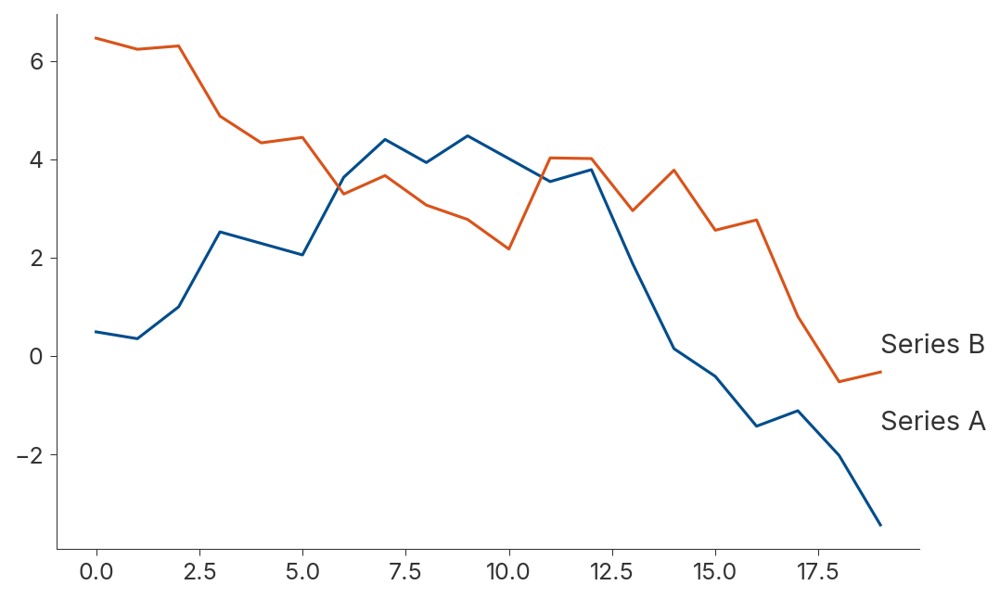
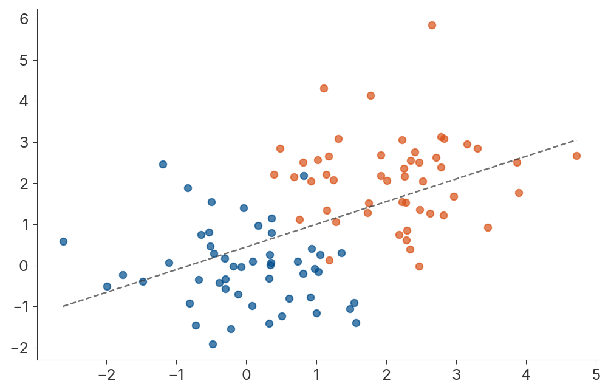
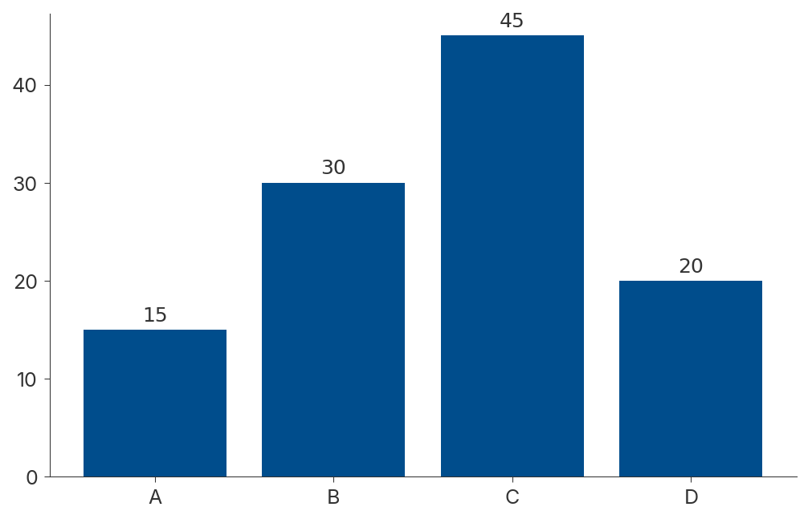
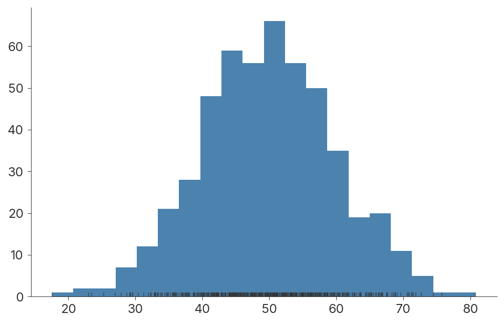

# tufteplots

Tufte-style plots for matplotlib, plotly and seaborn, from one API.

`tufteplots` applies Edward Tufte's principles to your charts: a high
data-ink ratio, no chartjunk, direct labels instead of legends, and small
multiples for comparison. You can create styled plots directly, or restyle a
figure you already have.

| Line | Scatter |
|---|---|
|  |  |
| **Bar** | **Histogram** |
|  |  |

## Installation

```bash
git clone https://github.com/OFFTECH/tufte_plots.git
cd tufte_plots
pip install -e .
```

Requires Python 3.9+, with matplotlib, plotly, seaborn and pandas.

## Quick start

```python
import pandas as pd
import tufteplots as tp

data = pd.DataFrame({"x": range(10), "y": [v**2 for v in range(10)]})

fig = tp.tufte_line_plot(data, "x", "y")
fig.savefig("line.png")
```

Restyle an existing matplotlib figure:

```python
import matplotlib.pyplot as plt

fig, ax = plt.subplots()
ax.plot([1, 2, 3], [1, 4, 9])
fig = tp.apply_tufte_style(fig)
```

Compare groups with small multiples:

```python
data = pd.DataFrame({
    "x": list(range(10)) * 3,
    "y": list(range(10)) * 3,
    "group": ["A"] * 10 + ["B"] * 10 + ["C"] * 10,
})
fig = tp.small_multiples(data, "x", "y", facet_by="group")
```

## Plot functions

| Function | What it draws |
|---|---|
| `tufte_line_plot(data, x, y, hue=None)` | Lines, with series labelled at their endpoints |
| `tufte_scatter_plot(data, x, y, hue=None, show_trend=False)` | Subtle markers, optional trend line |
| `tufte_bar_plot(data, x, y, show_values=True)` | Bars with value labels instead of gridlines |
| `tufte_histogram(data, column, bins=30, show_rug=True)` | Histogram with a rug plot |
| `small_multiples(data, x, y, facet_by, plot_type="line")` | A grid of plots on shared axes |
| `apply_tufte_style(figure)` | Restyles an existing figure |

Every function takes `backend="matplotlib"` (default), `"plotly"` or
`"seaborn"`, and returns that backend's figure object.

## Themes

Pass a `TufteTheme` to change fonts, sizes and colours:

```python
theme = tp.TufteTheme(
    font_family="Palatino",
    title_size=16,
    color_palette=["#4e79a7", "#f28e2b"],
)
fig = tp.tufte_line_plot(data, "x", "y", theme=theme)
```

The Inter typeface ships with the package and is registered with matplotlib on
import.

## Examples

`examples/comprehensive_demo.py` walks through every plot type, theme options,
cross-backend output and PNG/PDF/SVG export. See
[examples/README.md](examples/README.md).

The images above come from `examples/generate_readme_images.py`.

## Development

```bash
pip install -e ".[dev]"
pytest
```

## License

MIT
